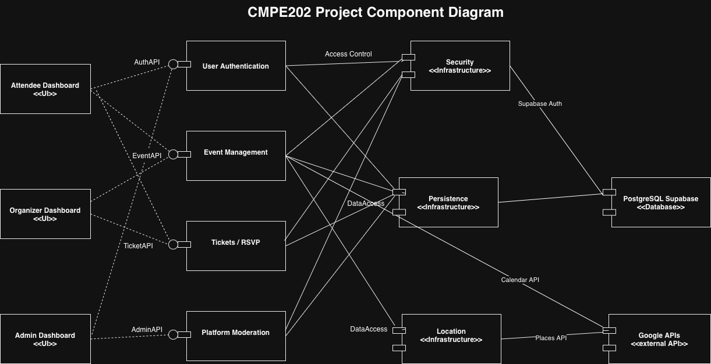
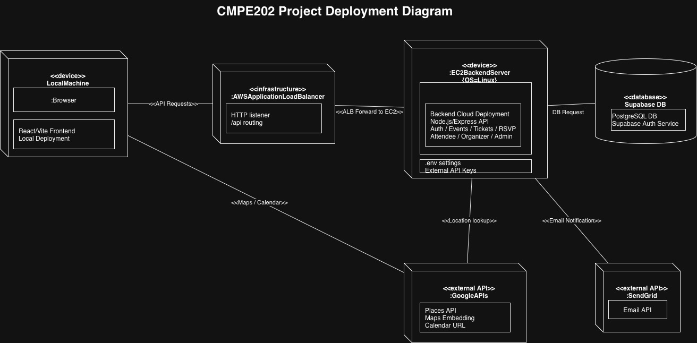

# Code Smellers

**Isaiah Callano** - Self-Appointed Project Manager, Admin for Supabase and Google Cloud Platform

**Connor Starnes** - Backend Lead, AWS Deployment Admin, Most Code Written

**Avneet Kaur Thind** - Frontend Lead, UI/UX Designer, Test Writer

**Jack Kibort** - User Story + Burndown Chart Automator, Full-Stack Developer

[Sprint Journal + Backlogs + Burndown Charts](https://docs.google.com/spreadsheets/d/13qeoltkKJG6WMwRhQXqeniMV62aO0sXjUlUNBmin17g/edit?usp=sharing)

[Wireframes](https://docs.google.com/drawings/d/1dWO6uze7gfvFrFekTF8Ov51uIQf5ioiAhiyGlJvf3Go/edit?usp=sharing)

Architecture Diagrams

### Design Decisions
#### Tech Stack
- React and Express are the default frontend/backend choice due to familiarity of the team

- AWS Deployment due to familiarity of the team

- Supabase for generous free tier, good documentation, managed cloud deployment, and `supabase-js` library, originally selected AWS RDS but the cost alone was a big downside

- Google Maps for easy integration with Google Places

- Google Places to use the same cloud platform, venue identification from potentially incomplete user input

- SendGrid for simplicity and suitability for small-scale projects. Brevo was considered if we needed more email volume

- NodeCron for lightweight, simple reminder email scheduler

#### Functional Decisions
- All users are potential organizers, instead of maintaining separate user and organizer accounts for one person

- All events are free, easier to integrate than fake payments (e.g. maintain a Stripe developer account, API keys, Node dependencies, etc.)

- Organizers can either manually enter a venue address or let Google Places automatically fill out location data from an incomplete query ("sjsu campus" -> "San José State University, 1 Washington Sq, San Jose")

- Same Google Places functionality for event search by location

### Feature Set
- User authentication and role-based access (attendee, organizer, admin)

- Event creation and management with date, time, location, and capacity

- Event discovery with search, filters, and category-based browsing

- Event detail pages with description, schedule, and organizer information

- Ticketing and registration; all events are free

- Google Calendar integration for saving events

- Google Maps integration for in-person events

- RSVP tracking and attendee management for organizers; organizers can view and remove attendees, see RSVP status

- SendGrid integration for confirmation and reminder emails

- Admin moderation and event approval workflow: Any user can create pending events, admins can approve or reject

- Secure API design with input validation in Express, deployed on AWS with a Load Balancer

- Responsive, accessible React UI for web devices

### Two XP Values
1. Communication - We emphasized regular communication through weekly/bi-weekly sprint video meetings with our cameras on. These meetings are about 1-2 hours long. They start off with a standup format but more often than not becomes an open forum after. In addition to our work discussions, we often engage in "parking lot" talk at the end of the meeting, talking about other classes, life outside school, and so on. Outside meetings, we also use Discord for quick communications like bug reports, code review requests, and spike story reporting. In class, during breaks, we engage in more "parking lot" talk, topics adjacent to the class discussion, or things completely unrelated to the class at all. We believe that this constant communication enhanced collaboration and work quality.

2. Feedback - For every change in the codebase, the changer has to submit a pull request. At least one other team member must perform a code review and approve, reject, or request changes. It is not typical for PRs to be outright rejected but when they do, some discussion is warranted during the next sprint meeting. We are direct but kind with our feedback, and each of us are open to feedback from others. We leave comments on pull requests, on Discord, and sometimes on the code itself. We talk about how others' code changes affect the overall project and our own developer experience.
